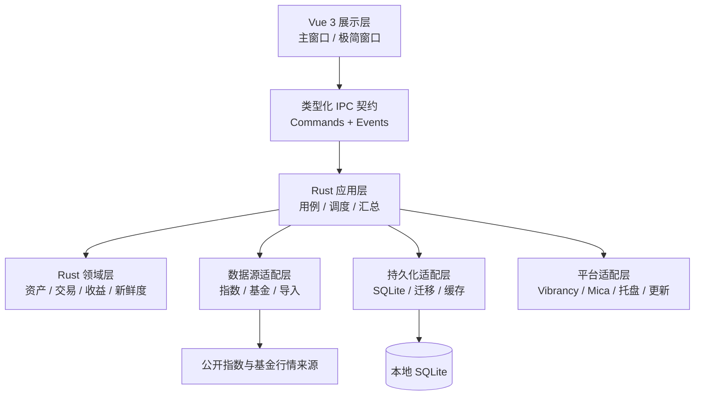
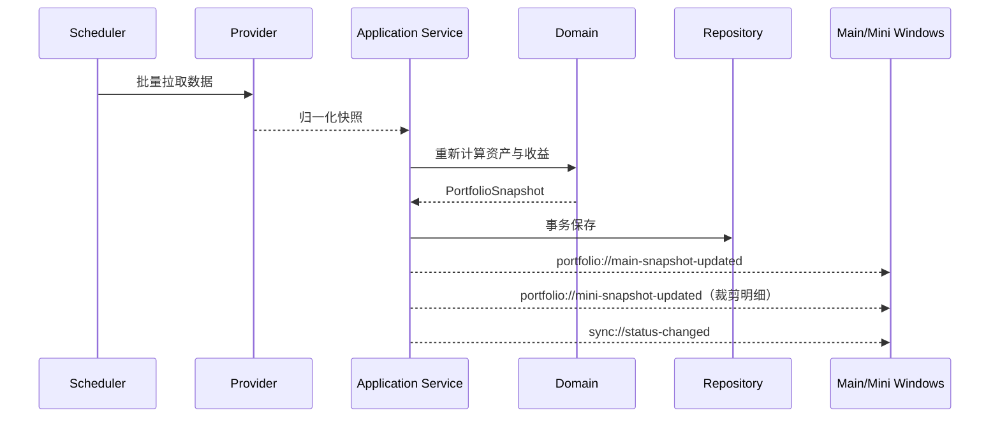

# 总体架构

## 1. 架构结论

采用 **Tauri 2 + Vue 3 + TypeScript + Rust + SQLite** 的本地优先架构。

- Tauri 负责跨平台窗口、托盘、自动更新、打包和权限边界。
- Vue 3 负责主窗口与极简窗口的界面。
- Rust 负责数据访问、业务计算、后台任务、持久化和操作系统适配。
- SQLite 保存资产、交易、行情缓存、同步记录和设置。
- 金额与收益计算只在领域层完成，界面不自行拼公式。

官方资料显示，Tauri 在 macOS 使用 WKWebView，在 Windows 使用 WebView2，并支持窗口定制、托盘、SQL、窗口状态和签名更新等桌面能力。

### 1.1 建议支持范围

| 平台 | 首发支持 | 说明 |
|---|---|---|
| macOS 13+ Apple Silicon | 正式支持 | 主要 macOS 构建目标 |
| macOS 13+ Intel | 正式支持 | 可单独构建或合并 Universal 包 |
| Windows 11 x64 | 正式支持 | 优先使用 Mica |
| Windows 10 22H2 x64 | 兼容支持 | 使用 Acrylic 或普通材质降级 |
| Windows on ARM | 后续验证 | 领域和 UI 不设架构障碍，发布前单独验证 |

Tauri 本身可覆盖更老的系统，但本项目不以停止维护的操作系统作为主要质量基线。最终范围在 Phase 0 的真实设备验证后冻结。

## 2. 架构原则

1. **领域与界面解耦**：资产、交易和收益计算不能依赖 Vue 或窗口状态。
2. **数据源可替换**：东方财富只是首个行情适配器，不进入领域模型。
3. **能力真实可用**：没有稳定官方接口或完整导出数据的平台能力不进入产品界面。
4. **本地优先**：没有网络时仍能查看最后一次资产和行情快照。
5. **显式新鲜度**：数据值、数据性质和更新时间作为一个整体传递。
6. **单一写入入口**：前端不能直接修改 SQLite，只能调用 Rust 应用服务。
7. **可迁移**：数据库、设置、IPC 契约和导入格式都有明确版本。
8. **平台能力降级**：玻璃、置顶和托盘异常不能阻断核心资产功能。

## 3. 逻辑分层



依赖方向必须指向领域层；领域层不引用 Tauri、SQLite、HTTP 或 Vue。

## 4. 推荐仓库结构

```text
market-glass/
├── apps/
│   └── desktop-ui/              # Vue 3 + TypeScript + Vite
│       └── src/
│           ├── app/             # 路由、启动、全局错误边界
│           ├── features/        # overview/analysis/funds/market/import/export
│           ├── components/      # 可复用展示组件
│           ├── stores/          # Pinia，只保存界面状态与查询结果
│           ├── ipc/             # Rust command/event 客户端
│           ├── theme/           # 跨平台设计令牌
│           └── windows/         # main/mini 两个入口
├── src-tauri/                   # Tauri 启动、配置与 capability
│   ├── src/
│   │   ├── commands/            # IPC 命令薄层
│   │   ├── events/              # 向窗口广播状态
│   │   ├── scheduler/           # 后台刷新编排
│   │   ├── windowing/           # 主窗口、极简窗口、托盘
│   │   └── bootstrap.rs         # 依赖组装
│   └── capabilities/            # 最小权限配置
├── crates/
│   ├── domain/                  # 纯领域模型与计算
│   ├── application/             # 用例、端口、DTO
│   ├── infrastructure/          # SQLite、HTTP、日志
│   └── providers/               # 外部数据源适配器
├── migrations/                  # 只增不改的数据库迁移
├── fixtures/                    # 脱敏接口样本和导入样本
├── docs/
│   └── adr/                     # 重要决策记录
└── tests/
    ├── contract/
    └── e2e/
```

## 5. 核心领域模型

### 5.1 主要实体

| 实体 | 作用 |
|---|---|
| `Account` | 一个数据来源或资产账户，如某投顾平台、基金平台或手动账户 |
| `Instrument` | 基金、指数、现金等可识别资产 |
| `Position` | 某账户持有的基金或投顾组合及成本信息 |
| `AdvisoryPortfolio` | 投顾组合本身，包括策略、来源和同步方式 |
| `AdvisoryConstituent` | 投顾组合底层基金、权重及有效日期 |
| `Transaction` | 申购、赎回、分红、费用、转入和转出 |
| `QuoteSnapshot` | 归一化后的行情、估值或正式净值 |
| `PortfolioSnapshot` | 某一时点的资产、当日盈亏和总盈亏 |
| `SyncSource` | 数据源配置、游标、最后成功时间和错误状态 |

### 5.2 值对象与枚举

```text
AssetKind       = Fund | Advisory | Cash | Index
DataNature      = Realtime | Estimated | Confirmed | Manual
Freshness       = Fresh | Delayed | Stale | Offline
SyncMode        = Api | FileImport | Manual
TransactionKind = Buy | Redeem | Dividend | Fee | TransferIn | TransferOut
```

金额统一使用十进制定点数或最小货币单位，禁止使用二进制浮点数累计成本。

## 6. 数据库设计

建议第一版包含以下表：

- `accounts`
- `instruments`
- `positions`
- `advisory_portfolios`
- `advisory_constituents`
- `transactions`
- `quote_snapshots`
- `portfolio_snapshots`
- `sync_sources`
- `app_settings`
- `import_jobs`

约束：

- 所有业务主键使用稳定 UUID，不依赖外部平台 ID。
- 外部 ID 使用 `(provider, external_id)` 唯一约束。
- 行情快照设置保留周期；资产和交易数据不得被自动清理。
- 数据库迁移只允许新增版本，已发布迁移不原地修改。
- 每次导入先进入临时批次，预览验证通过后在单一事务内提交。

## 7. 数据源适配架构

### 7.1 行情端口

```text
MarketDataProvider
├── fetch_indices(codes)
├── fetch_fund_snapshots(codes)
├── fetch_intraday_series(code)
└── health_check()
```

所有提供方返回统一的 `QuoteSnapshot`，包括：

- 资产标识
- 值与涨跌幅
- 数据性质
- 来源时间
- 获取时间
- 新鲜度
- 原始来源标识

第一阶段复用最新版插件已验证的逻辑，并归一化为 `HybridMarketDataProvider`：

1. 新浪 `getEstimateNetworthPic` 返回有效且日期不早于正式净值时，使用盘中估值。
2. 新浪无有效值时，读取东方财富披露持仓，并按成分股实时涨跌幅与披露权重加权估算；ETF 联接基金会继续解析 `ETFCODE`。
3. 仍不可估算时，回落到东方财富 `FundMNFInfo` 的最新确认净值和确认涨跌幅。

三级结果分别标记为 `Estimated/Fresh`、`Estimated/Delayed`、`Confirmed/Stale`，不会把历史净值冒充实时估值。未来替换任一来源时，不修改界面与领域计算。

指数默认复用东方财富 `push2`；当该域对本机 HTTP 客户端断流时，适配器自动回退到新浪指数行情。两种响应最终都归一化为同一个 `IndexMarketQuote`，不会影响界面和资产计算。

### 7.2 平台组合边界

雪球、且慢的个人投顾组合不在当前功能范围内。数据库迁移与领域枚举继续识别旧版 `advisory` 行，避免升级时破坏用户本地数据；应用服务在生成资产快照时过滤这些兼容记录，不把缺少底层基金的手工总金额包装成组合能力。只有未来获得稳定的官方授权接口或完整的用户导出格式后，才会另行设计接入方案。

### 7.3 可靠性策略

- 同一提供方共用限速器，禁止每个组件独立发请求。
- 指数和基金批量请求，避免逐条轮询。
- 失败采用指数退避并加入随机抖动。
- 连续失败时打开短时熔断，继续展示缓存。
- 解析失败保存脱敏诊断信息，但不覆盖最后一次有效值。

### 7.4 本地导入管线

插件配置文件使用可审计的本地导入管线：

```text
JSON 配置
  → 浏览器侧本地解析
  → FundImportDraft 可编辑预览
  → 前端格式校验与用户勾选
  → import_positions IPC（最多 500 项）
  → Rust 领域校验
  → SQLite 单事务 add/merge
  → 重新计算并广播资产快照
```

- 自选基金助手 3.x 导入器只读取 JSON，不修改原文件。
- `fundListGroup`、`fundListM`、`fundList` 是显式资产配置；`dataList` 是行情缓存，仅用于补充名称或无显式列表时的兼容回退。
- 基金代码和名称必须经过可编辑预览；份额、成本允许为 0，未经勾选的条目不会提交。
- 基金以 6 位代码作为唯一键；“新增/导入”遇到已有代码时累计份额与成本，“编辑”携带稳定 ID 时覆盖原记录。
- 未提供成本时领域层将累计盈亏标记为未知，不得把当前市值当作盈利；旧版本由 `dataList` 误导入的“历史持仓”会在读取阶段隔离，但不破坏本地原始记录。
- 任一条 Rust 领域校验或 SQLite 写入失败时，整个批次回滚。
- 导出采用同一可回导结构，并同时写入单份成本和精确累计成本；桌面命令只允许在系统下载目录创建 `.json`，文件重名时生成新文件而不覆盖旧备份。

### 7.5 持仓编辑管线

- 单项编辑携带稳定资产 ID，通过 `upsert_position` 覆盖份额、累计成本、名称和行业标签。
- 批量修改通过 `update_positions_partial` 提交，后端按项目调用独立原子写入；一项校验或唯一约束失败，只返回该项错误，不回滚已经成功的其他项目。
- 后端完成全部尝试后只重新拉取一次行情并广播快照，避免批量修改时为每项重复请求外部数据。
- 前端从批量弹窗移除成功项，保留失败项、用户刚输入的值和错误原因，允许直接修正后重试。

## 8. 后台刷新与事件流

Rust 后台调度器是唯一刷新入口，前端定时器不直接访问外部行情。

推荐默认节奏：

| 数据 | 交易时段 | 非交易时段 |
|---|---:|---:|
| 主要指数 | 15 秒 | 5 分钟或手动 |
| 基金盘中估值 | 30–60 秒 | 停止 |
| 基金确认净值 | 5 分钟轮询至更新 | 每日一次 |
| 投顾组合 | 按来源能力 | 按来源能力 |
| 资产汇总 | 上游数据变化后 | 上游数据变化后 |

事件流：



系统休眠唤醒、网络恢复和用户点击刷新时，调度器执行一次去重刷新，不能并发重复请求。

## 9. 双窗口状态与通信

- `main` 和 `mini` 是两个独立 WebView 窗口，共享同一个 Rust 应用状态。
- 两个窗口只订阅事件和执行命令，不互相直接读写状态。
- 隐私设置保存在 Rust 设置服务中，修改后广播给两个窗口。
- 极简窗口只接收裁剪后的汇总 DTO 和指数 DTO，永远不接收持仓明细 DTO；主窗口不得订阅极简快照事件。
- 窗口位置、尺寸、置顶状态按平台和显示器持久化。
- 后台任务不依赖窗口是否可见，避免最小化后浏览器定时器被节流。
- macOS 主窗口保留系统 `NSWindow` 红黄绿按钮和原生圆角；关闭事件被转换为隐藏窗口，真正退出只由托盘菜单触发。
- Windows 主窗口保持无边框并使用 Rust IPC 执行最小化/隐藏，避免仅调用前端 API 导致按钮失效。
- 内容卡片使用标准材质，Liquid Glass 只用于导航和按钮；按钮本体不随指针倾斜，只让内部高光滑动，避免命中区域闪动。系统开启“减少动态效果”时自动停用高光动画。

## 10. IPC 契约

建议按用例命名，不暴露数据库操作：

```text
portfolio.get_overview
portfolio.list_assets
portfolio.upsert_position
portfolio.record_transaction
market.get_indices
sync.refresh_all
sync.get_status
funds.import_preview
funds.import_commit
settings.get_privacy
settings.set_privacy
settings.set_overview_indices
settings.set_market_indices
```

事件：

```text
portfolio://main-snapshot-updated
portfolio://mini-snapshot-updated
market://indices-updated
sync://status-changed
settings://privacy-changed
settings://indices-changed
settings://market-indices-changed
```

Rust DTO 是契约源，生成或校验 TypeScript 类型；契约变更必须有兼容性测试。

## 11. 跨平台窗口效果

定义 `WindowEffectAdapter`，让视觉效果不进入业务代码。

```text
macOS          -> Vibrancy
Windows 11     -> Mica
Windows 10     -> Acrylic
Unsupported    -> OpaqueMaterialFallback
```

注意事项：

- macOS 透明 WebView 可能涉及 Tauri 的 private API 配置，会影响 Mac App Store 分发，因此把“商店版”和“官网下载版”视为两个发布策略。
- Windows Acrylic 在部分系统版本拖动或缩放时性能较差，主窗口优先 Mica/普通材质，极简窗口才考虑 Acrylic。
- 运行时检测能力并允许关闭特效；关闭后仍使用相同设计令牌。
- 保留原生窗口行为优先于完全自绘标题栏。

## 12. 安全与隐私

- 默认不上传资产数据，不引入账户登录。
- SQLite 只保存业务数据；平台令牌或密码使用操作系统安全存储/Stronghold。
- 前端没有任意文件、Shell、网络和原始 SQL 权限。
- Tauri capability 按 `main`、`mini` 和导入窗口分别最小授权。
- 日志不记录完整资产金额、账户标识、令牌和导入原文。
- 提供“一键导出诊断”，只包含版本、数据源状态和脱敏错误。
- 任何未来云同步必须作为独立模块和显式开关引入。

## 13. 可观测性与错误处理

- 本地滚动日志，按级别和模块记录。
- 为每次刷新生成 `correlation_id`，串联拉取、解析、计算和存储。
- 数据源错误、解析错误、数据库错误和计算错误使用不同错误码。
- UI 只显示可操作的信息，详细堆栈留在脱敏日志。
- 应用崩溃后从最后一次完整事务恢复，不读取半写入快照。

## 14. 测试策略

| 层级 | 重点 |
|---|---|
| 领域单元测试 | 申购、赎回、分红、费用、当日/总盈亏、投顾加权 |
| Provider 契约测试 | 使用脱敏固定响应验证字段变化和缺失字段 |
| Repository 测试 | 迁移、事务、唯一约束、导入回滚 |
| UI 组件测试 | 隐私规则、数据状态、明暗主题、空态与错误态 |
| 端到端测试 | 首次启动、添加基金、配置导入/导出、双窗口切换、离线恢复 |
| 平台冒烟测试 | macOS Intel/Apple Silicon、Windows 10/11 |

收益计算使用“黄金样本”测试，任何公式变化必须显式更新样本和 ADR。

## 15. 构建、发布与更新

- 使用 CI 构建 macOS 与 Windows，不在一个系统上假设交叉打包结果。
- macOS 输出签名、notarized 的 `.dmg`/`.app`，分别考虑 Apple Silicon 和 Intel/Universal。
- Windows 首期输出 NSIS 安装包，后续按需增加 MSI。
- 自动更新包必须签名；应用只接受受信任签名的更新。
- 发布采用 SemVer，数据库迁移和设置迁移随版本执行。
- 每次发布保留可回滚安装包，但不对已升级数据库执行破坏性降级。

## 16. 依赖治理

- 核心业务不依赖 UI 组件库。
- 第三方依赖必须有明确维护状态、许可证和跨平台支持。
- 锁定 Node 与 Rust 工具链版本，提交 lockfile。
- 每月执行依赖更新分支；安全更新优先，小版本集中升级。
- Tauri、WebView 和窗口效果升级必须经过 macOS/Windows 视觉冒烟测试。

## 17. 官方参考

- Tauri WebView 版本与平台实现：https://v2.tauri.app/reference/webview-versions/
- Tauri 窗口定制：https://v2.tauri.app/learn/window-customization/
- Tauri 官方插件能力：https://v2.tauri.app/plugin/
- Tauri SQL 与迁移：https://v2.tauri.app/plugin/sql/
- Tauri 更新签名与产物：https://v2.tauri.app/plugin/updater/
- Tauri GitHub 发布流水线：https://v2.tauri.app/distribute/pipelines/github/
- `window-vibrancy` 平台效果与限制：https://github.com/tauri-apps/window-vibrancy
